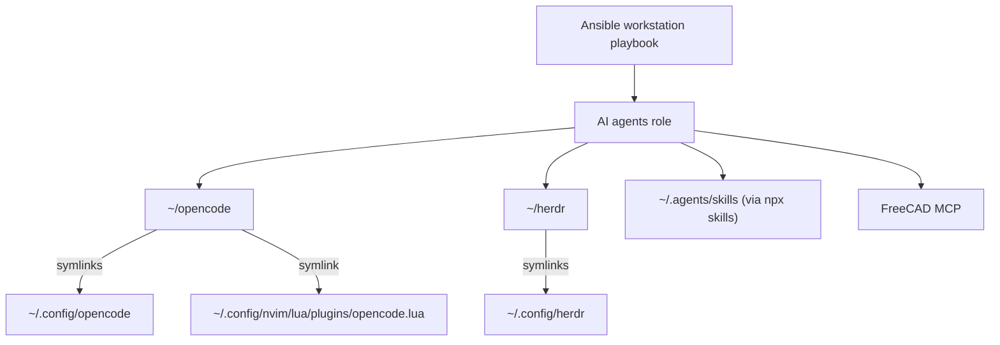

# ansible-workstation-playbook

Fully automated provisioning of the development environment based on Manjaro with i3.

DISCAIMER:
Note that this is still work in progress and some things can change and/or removed.

## Goals

Main goal of this project is to provide way to easly and automatically configure new workstation, server, virtual machine or docker container to heve persistent work environment across all machines.
As an option below actions should be available:

- [ ] Be able to configure GUI based environment
- [ ] Be able to configure CLI based environment
- [ ] Be able to upgrade OS to newest available version
- [ ] Be able to update single package to latest version by default

# Requirements

To run this playbook Ansible need to be installed on the operating system. Some kind of the Bash script that will install Ansible will be provided - please look to the Roadmap section.

Currently one Ansible Galaxy role is required to sucessfully run this playbook:
- [kewlfft.aur](https://github.com/kewlfft/ansible-aur)

All required roles had been addedd to the ``requirements.yml`` file and can be easly instaled by running command ``ansible-galaxy install -r requirements.yml`` before first run of the ``ansible-playbook ...`` command.

### Operating system

Projects was started with Manjaro Linux as operating system in mind, however usage ``ansible.builtin.package`` module should allow to install packages supported on another Linux distributions such Ubuntu or Fedora, but that wasn't proven yet.

### System upgrade

It's possible to upgrade operating system using this Ansible playbook by executing below command:
``ansible-playbook playbook.yml -l localhost -t osUpgrade ``
It's also possible to upgrade single package due to fact that in file ``group_vars/all`` as variable ``pkg_state`` latest is specyfied by default and each application is tagged.
``ansible-playbook playbook.yml -l localhost -t [app_name]``
If you would like to only ensure that packages are present just run this command:
``ansible-playbook playbook.yml -l localhoskt --extra-vars "pkg_state=present"``

## Setup

Currently manual installation of the Ansible is required, but in the near future Bash script will be provided to automate this task.
You can install Ansible using command ``pamac install ansible ansible-core`` or ``pacman -Syyu ansible ansible-core``.

## Usage

Provisioning of the clean workstation:

``ansible-playbook --ask-become-pass --ask-vault-pass playbook.yml -l localhost ``

## AI agent configuration

The `ai-agents` role installs the OpenCode, Herdr, Claude Code, and GitHub
Copilot CLIs, then wires them together:

- Clones the [OpenCode](https://github.com/MikePapaSierra/opencode) and
  [Herdr](https://github.com/MikePapaSierra/herdr) configuration repositories
  to `~/opencode` and `~/herdr`, installs OpenCode's npm dependencies, and
  links each repository's portable, reviewed files into the standard XDG
  paths (`~/.config/opencode`, `~/.config/herdr`, and
  `~/.config/nvim/lua/plugins/opencode.lua`). Runtime state, logs, sockets,
  node_modules, and credentials are deliberately left untracked.
- Installs Herdr's pinned plugins (Agent Usage, Herdr Plus, Token Dashboard,
  Yazi Explorer, and the Neovim navigation plugin) and their prerequisites
  (Go, Yazi, `jq`), and installs Herdr's OpenCode lifecycle integration hook.
- Registers the FreeCAD MCP server for Claude and GitHub Copilot with
  `claude mcp add` / `copilot mcp add`. OpenCode's MCP servers are declared
  directly in the tracked `opencode.jsonc` instead, so it isn't part of this
  step.
- Installs Agent Skills (https://skills.sh/) with the `skills` CLI (run
  through `npx`), which discovers every agent CLI on the machine (Claude,
  Copilot, OpenCode, etc.) and links each skill into that agent's own skills
  directory. Add entries to `ai_agent_skills` in
  `roles/ai-agents/defaults/main.yml` to install more.

Node.js and npm are not installed directly: they already arrive as a
dependency of the `opencode-bin`/`claude-code`/`github-copilot-cli` AUR
packages. Installing the repository `nodejs` package explicitly would
conflict with the `nodejs-lts-iron` package those AUR packages depend on.

Apply only this setup with:

``ansible-playbook playbook.yml -l localhost -t ai-agents``

Or a single piece of it with the `herdr`, `opencode`, `skills`, or `mcp` tags,
e.g.:

``ansible-playbook playbook.yml -l localhost -t herdr``

Update of the operating system:

``ansible-playbook playbook.yml -l localhost -t osUpgrade``

Update of the single package:

``ansible-playbook playbook.yml -l localhost -t [app_name] --extra-vars "pkg_state=latest"``

## Testing

Currently tests environments aren't available.

## Known Issues

Not known.

## TODO
### Pre-requisits
- Bash script that will install Ansible as pre-requisite
- Ensure that Ansible is present to be able run playbook

### Testing
- Docker image to test CLI based software
- VirtualBox based Vagrant box
- Libvirt based Vagrant box

### Shell/CLI
- Bash configuration task

### User
- Ensure that user account creation will not override data in home directory
- Create home folder structure

### i3
- Add OpenWeather API key encrypted by Ansible vault

### Cloud
- Tfsec task
- Checkov task

### Virtualization/containarization
- Task to install VirtualBox kernel module in case when vm on Windows is used for tests or as a workstation
- Task to install Kubespray

### Other
- Support for WSL/WSL
- Extend that to Ubuntu based OS

## License

Under [MIT License](/LICENSE.md).

## Credits

Creating this Ansible playbook I was heavly inspired by:

- [ThePrimeagen](https://github.com/ThePrimeagen) course [Developer Productivity](https://frontendmasters.com/courses/developer-productivity/) on [FrontendMasters](https://frontendmasters.com)
- [TheAltF4](https://github.com/ALT-F4-LLC) [dotfiles](https://github.com/ALT-F4-LLC/dotfiles) repository and [YouTube video](https://www.youtube.com/watch?v=V_Cj_p6se3k)
- [manjaro-playbook](https://github.com/PauloPortugal/manjaro-playbook/tree/main) by [PauloPortugal](https://github.com/PauloPortugal)
